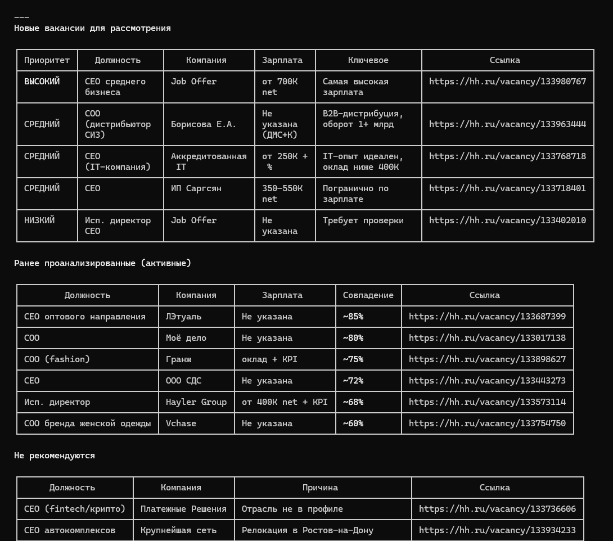
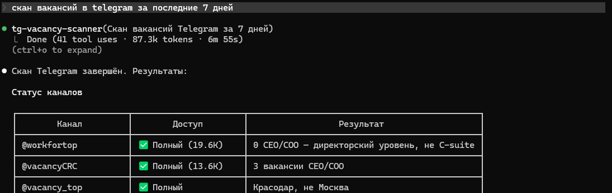
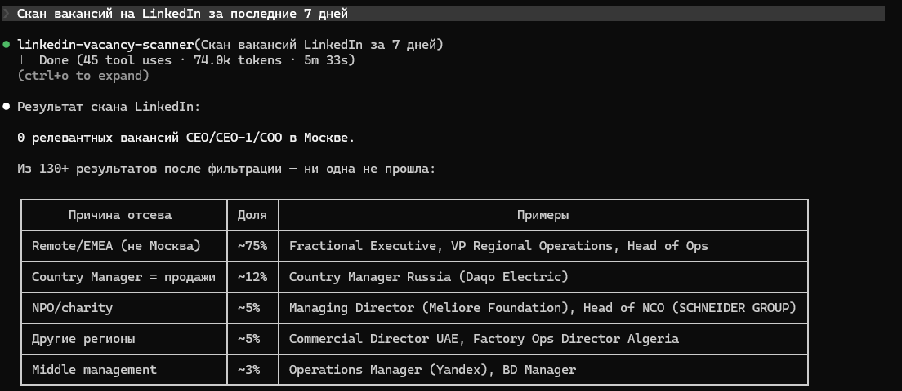
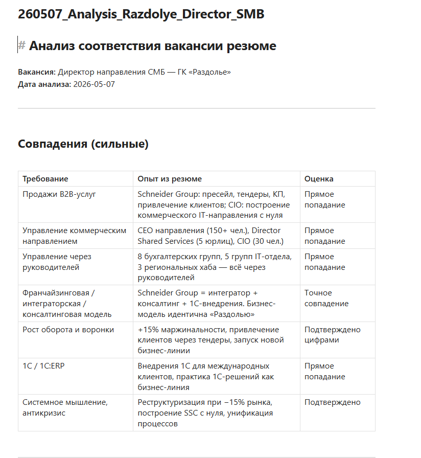
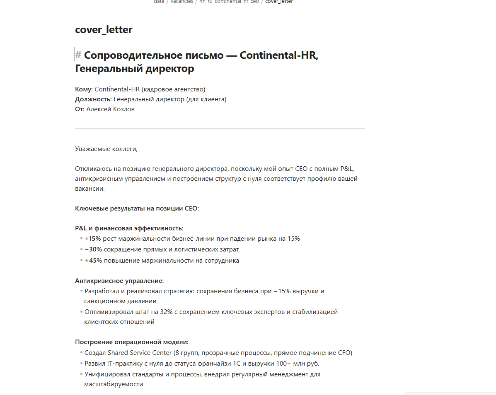
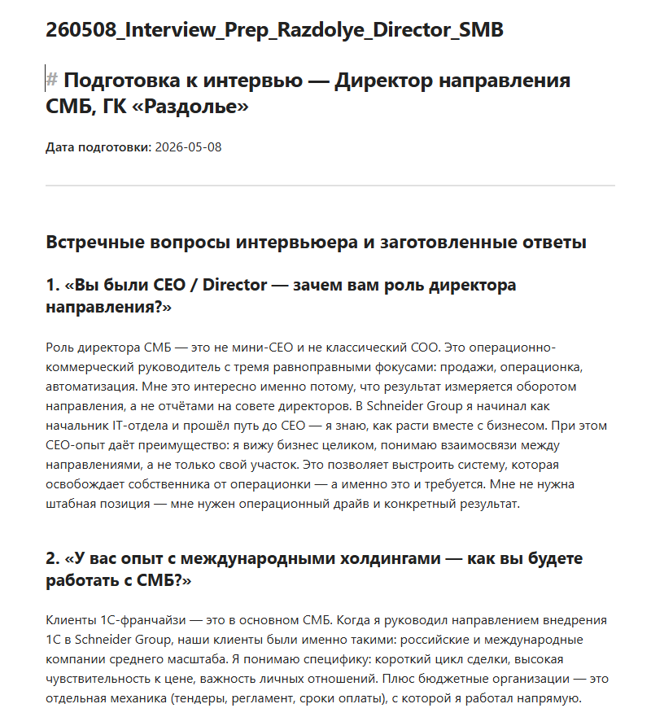

# Career-AI

ИИ-ассистент для поиска работы на топ-позиции (CEO / CEO-1 / COO). Автоматизирует полный цикл: от сканирования вакансий до сопроводительного письма и подготовки к собеседованию.

## Проблема

Поиск работы на позиции CEO / CEO-1 / COO — это не массовый отклик на сотни вакансий, а точечная работа с ограниченным числом релевантных предложений. Ручной мониторинг hh.ru, LinkedIn, Telegram-каналов занимает часы. Анализ соответствия вакансии профилю, написание сопроводительных писем и подготовка к собеседованиям — повторяющиеся задачи, которые можно автоматизировать, сохранив качество и персонализацию.

## Решение

Career-AI — набор инструкций и алгоритмов для [Claude Code](https://claude.com/claude-code), который:

1. **Ищет вакансии** — сканирует hh.ru, LinkedIn, Telegram-каналы по ключевым запросам
2. **Фильтрует** — убирает нерелевантные (ассистентские, узкоотраслевые, несоответствующего калибра, с зарплатой ниже порога)
3. **Анализирует** — сравнивает требования вакансии с резюме кандидата, считает % совпадения, выявляет пробелы
4. **Пишет сопроводительные** — генерирует письмо под конкретную вакансию с акцентом на цифры и достижения
5. **Готовит к собеседованиям** — вероятные вопросы, аргументы из опыта, проработка слабых мест
6. **Оптимизирует профиль** — рекомендации по улучшению hh.ru и LinkedIn

```
┌─────────────────────────────────────────────────────────┐
│  1. СКАНИРОВАНИЕ ВАКАНСИЙ                                │
│  ┌───────────┐  ┌───────────┐  ┌───────────────────┐     │
│  │  hh.ru    │  │ LinkedIn  │  │ Telegram-каналы   │     │
│  └─────┬─────┘  └─────┬─────┘  └────────┬──────────┘     │
│        └──────────────┼─────────────────┘                │
│                       ▼                                  │
│  2. ФИЛЬТРАЦИЯ                                          │
│  ──────────────────────────────────────────              │
│  Убрать:                                                │
│  • зарплата < 400K  • не Москва  • ассистентские         │
│  • узкоспециализированные замы  • несовместимые отрасли   │
│                       ▼                                  │
│  3. АНАЛИЗ СООТВЕТСТВИЯ                                  │
│  ──────────────────────────────────────────              │
│  Требования вакансии  ←→  Резюме кандидата              │
│  Результат: % совпадения, сильные стороны, пробелы       │
│                       ▼                                  │
│  4. РЕЗУЛЬТАТЫ                                          │
│  ┌──────────────┐  ┌────────────┐  ┌──────────────────┐  │
│  │ Топ-приоритет│  │ Средний    │  │ Не рекомендуются │  │
│  │ совпад ≥70%  │  │ 30–70%     │  │ <30%              │  │
│  └──────┬───────┘  └──────┬─────┘  └──────────────────┘  │
│         ▼                 ▼                               │
│  5. АРТЕФАКТЫ ПО ВАКАНСИИ                               │
│  ──────────────────────────────────────────              │
│  📄 vacancy_description.md  — описание вакансии          │
│  📊 analysis.md             — анализ + рекомендация      │
│  ✉️ cover_letter.docx       — сопроводительное письмо    │
└─────────────────────────────────────────────────────────┘
```

## Пользователь

Топ-менеджер с 30-летним стажем. Последние 20 лет — работа в дочерних организациях немецких компаний в РФ (SCHNEIDER GROUP, WORTMANN GROUP). Индустрии: оптовая и розничная торговля fashion, IT-консалтинг, внедрение систем на базе 1С, развитие IT-инфраструктуры, аутсорсинг учётных функций. Ищет позицию CEO / CEO-1 / COO в Москве, релокация не рассматривается.

## Источники вакансий

### hh.ru

Основная площадка. Сканирование по 4 запросам: *генеральный директор*, *CEO*, *COO*, *исполнительный директор*. Фильтрация по Москве (`area=1`) и дате публикации. Результаты группируются:
- **Топ-уровень** (от 600K ₽) — CEO/CEO-1 позиции
- **Средний уровень** (400–600K ₽) — CEO/CEO-1 позиции
- **COO / Операционные директора** — потенциальные CEO-1

### LinkedIn

Поиск через LinkedIn Jobs с фильтрацией по уровню позиции и локации Москва. LinkedIn структурно беден на CEO-позиции в Москве — основное значение: нетворкинг и обнаружение через хедхантеров.

### Telegram-каналы

| Канал | Подписчики | Описание |
|---|---|---|
| @workfortop | 19.6K | Топ-позиции, встречаются CEO-вакансии |
| @vacancyCRC | 13.6K | Middle/top менеджмент, CEO-уровень |

## Агенты для поиска вакансий

Сканирование площадок выполняется специализированными агентами Claude Code:

| Площадка | Агент | Что делает |
|---|---|---|
| hh.ru | `hh-ru-vacancy-scanner` | Поиск по 4 запросам, фильтрация, анализ соответствия, сохранение результатов |
| Telegram | `tg-vacancy-scanner` | Чтение каналов, извлечение вакансий, фильтрация, анализ |
| LinkedIn | `linkedin-vacancy-scanner` | Поиск LinkedIn Jobs, фильтрация по уровню и локации |

Агенты выполняют полный цикл: поиск → фильтрация → анализ соответствия резюме → сохранение результатов в `data/vacancies/`.

## Критерии фильтрации

Вакансии исключаются если:

- Ассистентская позиция (помощник, секретарь, водитель генерального директора)
- Зарплата ниже 400K ₽ (если не указана — оставляется на проверку)
- Не Москва
- Узкоспециализированные замы (зам. по производству, по строительству)
- Жёсткие отраслевые требования без опыта (нефтегаз, пищевое производство, фармацевтика)
- Специфические лицензии (аттестат ЦБ РФ, главный инженер)
- Позиция уровня 200–300K, названная CEO/COO

## Артефакты по вакансии

Для каждой релевантной вакансии создаётся папка в `data/vacancies/`:

| Файл | Содержание |
|---|---|
| `vacancy_description.md` | Структурированное описание: должность, компания, требования, обязанности |
| `analysis.md` | Совпадения с резюме, пробелы, % соответствия, рекомендация |
| `cover_letter.md` | Сопроводительное письмо в Markdown |
| `cover_letter.docx` | Сопроводительное письмо в Word |

## Структура проекта

```
career-ai/
├── CLAUDE.md                              # Инструкции для Claude Code
├── README.md                              # Этот файл
├── career-ai-project-description.md        # Описание проекта
├── scripts/
│   └── md_to_docx.py                      # Генерация Word-документов
└── data/
    ├── vacancies/                          # Анализ вакансий (не в репозитории)
    │   ├── hh-ru-scan-YYYY-MM-DD/         # Сканы hh.ru по датам
    │   ├── tg-scan-YYYY-MM-DD/             # Сканы Telegram по датам
    │   ├── linkedin-scan-YYYY-MM-DD/       # Сканы LinkedIn по датам
    │   └── <название-вакансии>/            # Детальный анализ вакансии
    │       ├── vacancy_description.md
    │       ├── analysis.md
    │       └── cover_letter.docx
    └── reports/                            # Аналитические отчёты (не в репозитории)
```

## Технологии

| Компонент | Технология |
|---|---|
| AI-ассистент | [Claude Code](https://claude.com/claude-code) (Anthropic) |
| Агенты сканирования | hh-ru-vacancy-scanner, tg-vacancy-scanner, linkedin-vacancy-scanner |
| Поиск в интернете | Brave Search MCP |
| Чтение веб-страниц | Jina Reader (`r.jina.ai`) |
| LinkedIn | LinkedIn MCP (авторизованный доступ) |
| Документы | python-docx |

## Как использовать

1. Установите [Claude Code](https://claude.com/claude-code)
2. Клонируйте репозиторий
3. Поместите своё резюме в `data/` (формат Markdown)
4. Обновите `CLAUDE.md` под свой профиль
5. Запустите Claude Code в директории проекта

```
# Скан вакансий на hh.ru за последние 7 дней
Сканируй hh.ru за 7 дней
```

```
# Скан Telegram-каналов
Проверь вакансии в телеграме
```

```
# Скан вакансий в LinkedIn
Проверь вакансии в LinkedIn
```

```

# Анализ конкретной вакансии по ссылке
Проанализируй вакансию https://hh.ru/vacancy/12345678
```

```
# Сопроводительное письмо
Напиши сопроводительное для вакансии из data/vacancies/название/
```

```
# Подготовка к собеседованию
Подготовься к собеседованию по вакансии из data/vacancies/название/
```



## Настройка под себя

1. Замените данные кандидата в `CLAUDE.md` (раздел «Твой человек»)
2. Поместите своё резюме в `data/` и укажите путь в `CLAUDE.md`
3. Скорректируйте критерии фильтрации (зарплатный порог, локация, отрасли)
4. Добавьте/удалите Telegram-каналы в разделе «Алгоритм поиска вакансий в Telegram»

## Результаты

За период использования (май–июнь 2026) проект обработал **20+ вакансий** с трёх площадок:

- **hh.ru** — еженедельные сканы по 4 запросам, основной источник вакансий
- **Telegram** — мониторинг 2 каналов (@workfortop, @vacancyCRC)
- **LinkedIn** — структурно беден на CEO-позиции в Москве, основное значение: нетворкинг

Для каждой релевантной вакансии подготовлен полный пакет: описание, анализ соответствия (с % совпадения), сопроводительное письмо.

## Лицензия

Частный проект.
